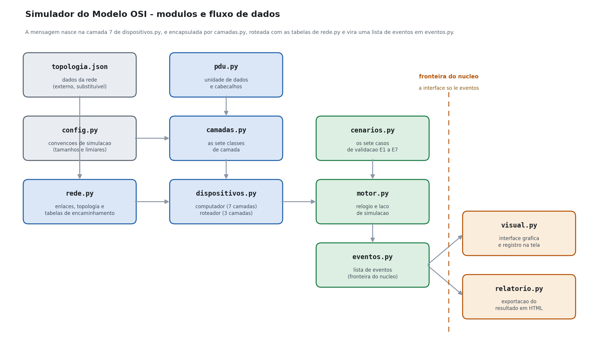

# Documentação técnica

**Simulador do Modelo OSI**
Comunicação de Dados — Prof. Vinícius S. Borges
Guilherme Matheus Teixeira Costa — 081240041

---

## 1. Visão geral

O simulador reproduz o percurso de uma mensagem entre dois computadores de uma
rede com três redes locais, quatro roteadores e cinco computadores. Implementa
o modelo de sete camadas ISO/OSI: computadores possuem as sete camadas e
roteadores possuem apenas as três primeiras.

A execução é dirigida a eventos. Uma mensagem gerada na camada 7 desce até a
camada 1 do computador de origem, atravessa um enlace de cada vez, sobe até a
camada 3 de cada roteador para que a rota seja decidida, desce de novo pela
camada 2 em um quadro inteiramente novo e, ao chegar ao destino, sobe até a
camada 7. Cada ação de cada camada produz um evento, e a lista ordenada desses
eventos é o único produto que a interface consome.

A interface oferece ainda uma exportação do resultado em HTML, em um arquivo
único que pode ser aberto em qualquer navegador.

---

## 2. Separação entre as camadas

Este é o eixo do projeto.

### 2.1 A interface entre camadas adjacentes

Cada camada é uma classe com dois métodos de sentido oposto:

| Método | Recebe | Devolve | Papel |
|---|---|---|---|
| `desce` | a unidade vinda da camada superior | a unidade acrescida do que esta camada insere | encapsulamento |
| `sobe` | a unidade vinda da camada inferior | a unidade sem o que esta camada remove | desencapsulamento |

Uma camada nunca chama outra camada. Quem encadeia as chamadas é o objeto do
dispositivo, em `dispositivos.py`:

```python
unidade, eventos = self.aplicacao.desce(texto, contexto)
unidade, eventos = self.apresentacao.desce(unidade, contexto)
unidade, eventos = self.sessao.desce(unidade, contexto)
```

Como a sequência é montada fora das camadas, nenhuma delas guarda referência a
outra, e por isso nenhuma consegue alcançar uma camada não adjacente. O
acoplamento que existiria se a camada 7 chamasse a camada 4 simplesmente não
tem como ser escrito: a camada 7 não possui atributo algum que aponte para a
camada 4.

A única informação que trafega entre camadas adjacentes fora da unidade de
dados é a decisão de rota, depositada pela camada 3 no dicionário `contexto`
sob a chave `saida`, e lida pela camada 2 imediatamente a seguir.

### 2.2 Por que o roteador não consegue ler uma porta

A restrição R1 do enunciado é estrutural, não uma convenção de disciplina. A
classe `Roteador` instancia exatamente três camadas:

```python
class Roteador:
    def __init__(self, nome: str) -> None:
        self.nome = nome
        self.rede = CamadaRede()
        self.enlace = CamadaEnlace()
        self.fisica = CamadaFisica()
```

Não existe no objeto nenhum atributo `transporte`, `sessao`, `apresentacao` ou
`aplicacao`. Consequentemente:

1. não há método capaz de remover o cabeçalho da camada 4;
2. não há decodificador que saiba interpretar os oito octetos desse cabeçalho;
3. a camada 3 do roteador recebe um pacote cujo campo `dados` é uma sequência
   opaca de octetos, e o único campo que ela lê é o endereço lógico de destino
   gravado no cabeçalho da camada 3.

O número da porta está fisicamente presente nos octetos que atravessam o
roteador, exatamente como acontece em uma rede real. O que o roteador não tem
é qualquer meio de alcançá-lo. Uma tentativa de consultar a porta dentro do
código do roteador não compila silenciosamente: levanta `AttributeError`.

Um teste automatizado confere essa propriedade pelo lado de fora, percorrendo
o registro de eventos e exigindo que nenhum evento produzido por um roteador
tenha camada maior que 3.

### 2.3 O quadro não é reescrito

A restrição R2 é garantida pela construção. Ao receber um quadro, a camada 2
confere a verificação de erro, remove o cabeçalho e o finalizador e entrega o
pacote à camada 3. O quadro recebido é então descartado: o quadro de saída é
um objeto novo, produzido por `CamadaEnlace.desce`, com outro par de endereços
físicos, outro número de quadro e outra verificação de erro calculada do zero.
A camada 2 não sabe para onde o pacote vai, e a camada 3 não sabe por qual
meio ele chegou.

O registro torna isso visível a cada salto, com duas linhas consecutivas:

```
010 | R1 | L2 | DESENQUADRA  | verificacao de erro correta, quadro Q1 descartado   74 B
011 | R1 | L3 | ROTEIA       | 10.0.3.0/24 via R4, custo 2, interface e1           74 B
012 | R1 | L2 | ENQUADRA     | BB:...:01:01 → BB:...:04:00, quadro Q2              92 B
```

### 2.4 Endereços fixos e endereços locais

O par de endereços lógicos entra uma única vez, na camada 3 da origem, e não é
reescrito em nenhum salto: os roteadores apenas o leem. O par de endereços
físicos vale somente dentro de um enlace e é substituído a cada salto. A tela
mostra os dois pares ao mesmo tempo, lado a lado, justamente para que a
diferença fique visível.

### 2.5 A camada de enlace não escolhe rota

Toda decisão de encaminhamento acontece em `CamadaRede._decidir`, que consulta
a tabela de encaminhamento e escreve o resultado em `contexto["saida"]`. A
camada 2 lê desse dicionário apenas dois valores já resolvidos: o endereço
físico de origem e o endereço físico de destino do salto. Ela não tem acesso à
topologia nem à tabela de rotas.

### 2.6 Cada camada conversa com a sua par

O cabeçalho inserido por uma camada só é removido e interpretado pela camada de
mesmo número no outro extremo do escopo correspondente:

| Camada | Escopo | Quem remove o cabeçalho |
|---|---|---|
| 2 | um enlace | a camada 2 do vizinho |
| 3 | fim a fim | a camada 3 do destino final |
| 4 | processo a processo | a camada 4 do destino final |
| 5 | o diálogo | a camada 5 do destino final |
| 6 | a representação | a camada 6 do destino final |

A cifra da camada 6 comprova o ponto: o conteúdo é cifrado na camada 6 da
origem e só volta a ser legível na camada 6 do destino. Em nenhum ponto
intermediário o texto original aparece, e um teste automatizado percorre todos
os eventos de E2 para confirmar isso.

---

## 3. Diagrama de módulos



O fluxo, da geração da mensagem até a entrega ao processo de destino:

1. `rede.py` lê `topologia.json` e monta dispositivos, interfaces e segmentos;
2. `cenarios.py` descreve qual fluxo simular e quais falhas provocar;
3. `motor.py` pede ao computador de origem que gere a mensagem;
4. `dispositivos.py` encadeia as camadas de `camadas.py`, que operam sobre a
   unidade de dados de `pdu.py` com as constantes de `config.py`;
5. cada ação produz um `Evento` de `eventos.py`;
6. `motor.py` leva o quadro de enlace em enlace, consultando em cada nó a
   decisão tomada pela camada 3 daquele nó;
7. a lista de eventos completa é entregue a `visual.py` ou a `relatorio.py`.

A linha tracejada do diagrama marca a fronteira do núcleo. À direita dela não
existe nenhuma chamada a métodos de camada: `visual.py` e `relatorio.py`
apenas leem eventos.

---

## 4. Estrutura da unidade de dados

A unidade é modelada pela classe `UnidadeDados`, em `simulador/pdu.py`. O mesmo
objeto muda de nome conforme a camada em que se encontra: mensagem nas camadas
7 a 5, segmento na 4, pacote na 3, quadro na 2 e sequência de bits na 1.

| Campo | Tipo | Função |
|---|---|---|
| `dados` | `bytes` | Carga útil corrente, em octetos reais |
| `cabecalhos` | `list[Cabecalho]` | Cabeçalhos já acrescentados, da esquerda para a direita |
| `finalizador` | `Cabecalho \| None` | Finalizador da camada 2, à direita dos dados |
| `unidade` | `str` | Nome da unidade: Mensagem, Segmento, Pacote, Quadro ou Bits |
| `logicos` | `tuple[str, str]` | Par de endereços lógicos, fixo de ponta a ponta |
| `fisicos` | `tuple[str, str]` | Par de endereços físicos do salto corrente |
| `portas` | `tuple[int, int]` | Par de portas de origem e destino |
| `processos` | `tuple[str, str]` | Par de nomes de processo, o endereço específico |
| `sessao` | `str` | Identificador de sessão, como `S-0001` |
| `pacote` | `str` | Rótulo do pacote, como `P1` |
| `quadro` | `str` | Rótulo do quadro, como `Q3` |
| `numero_segmento` | `int` | Posição deste segmento na mensagem |
| `total_segmentos` | `int` | Quantidade de segmentos gerados |
| `texto_original` | `str \| None` | Texto legível; existe apenas nos extremos |
| `metadados` | `dict` | Enlace em que o quadro viaja e marca de bit alterado |

Cada cabeçalho é uma sequência real de octetos, não uma contagem simbólica:

| Cabeçalho | Octetos | Conteúdo |
|---|---|---|
| L5 sessão | 4 | número da sessão em ASCII |
| L4 transporte | 8 | porta de origem, porta de destino, número e total de segmentos |
| L3 rede | 20 | versão, comprimento, identificação, TTL, protocolo e o par de endereços lógicos |
| L2 cabeçalho | 14 | endereço físico de destino, de origem e tipo de protocolo |
| L2 finalizador | 4 | CRC-32 sobre o cabeçalho da camada 2 e a carga |

O método `tamanho()` devolve a soma efetiva desses octetos, e é esse número que
aparece no fim de cada linha do registro. O método `blocos()` descreve a
unidade como uma lista de blocos com rótulo, tamanho e camada, que é o que a
interface desenha no requisito V3.

---

## 5. Interface dos módulos

### `simulador.rede.Topologia`

| Método | Recebe | Devolve | O que faz |
|---|---|---|---|
| `carregar` | caminho do JSON | — | Lê o arquivo, monta as estruturas e valida a coerência |
| `tabela_encaminhamento` | nome do dispositivo | `list[EntradaRota]` | Redes diretas mais, para roteadores, as rotas de menor custo |
| `consultar_rota` | dispositivo, endereço lógico | `EntradaRota \| None` | Escolhe a entrada pelo prefixo mais longo |
| `resolver_fisico` | endereço lógico, segmento | `str \| None` | Consulta de endereço físico restrita ao enlace |
| `definir_estado_enlace` | identificador, ativo | — | Derruba ou restaura um enlace |
| `caminho_previsto` | origem, endereço lógico | `list[str] \| None` | Percorre as tabelas e antecipa o percurso |

### `simulador.dispositivos.Computador`

| Método | Recebe | Devolve | O que faz |
|---|---|---|---|
| `preparar_envio` | texto, contexto | segmentos e eventos comuns | Percorre as camadas 7 a 4 |
| `despachar` | segmento, contexto | quadro e eventos | Percorre as camadas 3 a 1 |
| `receber` | unidade, contexto | mensagem e eventos | Percorre as camadas 1 a 7 |

### `simulador.dispositivos.Roteador`

| Método | Recebe | Devolve | O que faz |
|---|---|---|---|
| `encaminhar` | quadro, contexto | novo quadro e eventos | Sobe L1-L2-L3, decide a rota e desce L2-L1 |

### `simulador.motor.Motor`

| Método | Recebe | Devolve | O que faz |
|---|---|---|---|
| `executar` | lista de `Fluxo`, enlaces derrubados, enlace com erro | `ResultadoSimulacao` | Simula todos os fluxos e consolida eventos, quadros e eficiência |

### `simulador.camadas`

Sete classes, cada uma com `desce` e `sobe`. `CamadaRede` tem um terceiro
método, `encaminha`, usado apenas pelo roteador: ele decide a rota sem remover
o cabeçalho da camada 3.

---

## 6. Parâmetros configuráveis

Todos estão reunidos em `simulador/config.py`.

| Parâmetro | Faixa válida | Padrão | O que controla |
|---|---|---|---|
| `TAMANHO_CABECALHO_SESSAO` | ≥ 1 | 4 octetos | Cabeçalho da camada 5 |
| `TAMANHO_CABECALHO_TRANSPORTE` | = 8 | 8 octetos | Cabeçalho da camada 4 |
| `TAMANHO_CABECALHO_REDE` | = 20 | 20 octetos | Cabeçalho da camada 3 |
| `TAMANHO_CABECALHO_ENLACE` | = 14 | 14 octetos | Cabeçalho da camada 2 |
| `TAMANHO_FINALIZADOR_ENLACE` | = 4 | 4 octetos | Finalizador da camada 2 |
| `LIMIAR_SEGMENTACAO` | ≥ 20 | 64 octetos | Acima disso a camada 4 segmenta |
| `CARGA_MAXIMA_SEGMENTO` | ≥ 10 | 40 octetos | Carga máxima de cada segmento |
| `CHAVE_CIFRA` | não vazia | `b"OSI"` | Chave da cifra da camada 6 |
| `CODIFICACAO` | codificação válida | `utf-8` | Conversão de texto em octetos na camada 6 |
| `TTL_INICIAL` | 1 a 255 | 64 | Campo TTL do cabeçalho da camada 3 |
| `VELOCIDADES` | 4 opções | 1400, 800, 350 e 120 ms | Intervalo entre passos na reprodução contínua |
| `VELOCIDADE_PADRAO` | 0 a 3 | 2 (Normal) | Velocidade inicial |
| `ARQUIVO_TOPOLOGIA_PADRAO` | nome de arquivo | `topologia.json` | Rede carregada ao abrir |

Os três últimos tamanhos de cabeçalho são fixados pelo enunciado e não devem
ser alterados: mudá-los torna os números incomparáveis com os dos demais
projetos da turma.

O caminho do arquivo de topologia é sempre relativo. A função
`config.diretorio_base()` devolve a pasta do executável quando o programa roda
empacotado, e a raiz do projeto quando roda a partir do código-fonte. Nenhum
caminho absoluto aparece no código.

---

## 7. Funcionamento interno, passo a passo

### 7.1 A descida na origem

1. **Camada 7** gera a mensagem e registra o par de processos, que é o
   endereço específico. O texto ainda é texto.
2. **Camada 6** converte o texto em octetos UTF-8 e cifra o resultado com uma
   cifra de fluxo por ou-exclusivo. A cifra é involutiva e preserva o
   comprimento, de modo que os tamanhos da convenção continuam valendo.
3. **Camada 5** atribui um identificador de sessão e acrescenta quatro octetos
   com o número dessa sessão.
4. **Camada 4** recebe da camada 5 um bloco formado pelo cabeçalho de sessão
   mais o conteúdo cifrado. Se o bloco não passa de 64 octetos, ele viaja
   inteiro em um segmento; se passa, é fatiado. Em qualquer caso, oito octetos
   de cabeçalho são acrescentados, com o par de portas, o número do segmento e
   o total.
5. **Camada 3** acrescenta vinte octetos com o par de endereços lógicos,
   consulta a tabela de encaminhamento e deposita a decisão no contexto.
6. **Camada 2** acrescenta catorze octetos com o par de endereços físicos do
   salto, calcula o CRC-32 sobre tudo isso e o grava nos quatro octetos do
   finalizador.
7. **Camada 1** converte o quadro em uma sequência de bits e o transmite.

### 7.2 O salto

O motor lê, no próprio quadro, o enlace em que ele viaja — anotado ali pela
camada 2 no momento do enquadramento — e o entrega ao vizinho daquele enlace.
O motor não escolhe rota: ele apenas transporta.

No vizinho, a camada 1 recebe os bits, a camada 2 refaz a conta da verificação
de erro e compara com o finalizador recebido. Se conferir, remove o cabeçalho
e o finalizador e entrega o pacote à camada 3; o quadro recebido é descartado.

### 7.3 A decisão de rota no roteador

`CamadaRede.encaminha` lê o endereço lógico de destino e chama
`Topologia.consultar_rota`, que percorre a tabela do roteador e escolhe a
entrada de prefixo mais longo que cobre o destino. Em caso de empate de
prefixo, vence o menor custo.

Se a entrada é uma rede diretamente conectada, o próximo salto é o próprio
destino e a entrega é direta. Se é remota, o próximo salto é o endereço
gravado na entrada. Em seguida o endereço físico correspondente é resolvido
dentro do segmento de saída, e a decisão é depositada no contexto para que a
camada 2 monte o quadro seguinte.

Quando nenhuma entrada cobre o destino, a camada 3 registra o descarte e a
cadeia termina ali. É o que acontece no cenário E5: H1 possui rota padrão e
entrega o pacote a R1, e R1 é o primeiro nó sem rota para `10.0.9.10`.

### 7.4 A subida no destino

A camada 3 do destino confere que o endereço lógico de destino é seu, remove o
cabeçalho e entrega o segmento à camada 4. A camada 4 lê o próprio cabeçalho,
identifica o fluxo pelo par de portas e, se houver mais de um segmento, retém
cada um em um buffer até que todos cheguem. Só então concatena as cargas em
ordem de número e entrega a mensagem completa à camada 5. As camadas 5, 6 e 7
encerram a sessão, decifram o conteúdo e entregam a mensagem ao processo.

### 7.5 Quando um quadro chega corrompido

A injeção de erro inverte um bit da carga do quadro depois que ele entrou no
enlace e antes que o receptor o veja, sem tocar no finalizador — é o que um
meio ruidoso faz. A camada 2 do receptor refaz a conta, encontra um valor
diferente do finalizador recebido, registra o descarte e devolve `None`. Como
o dispositivo só chama a camada 3 quando a camada 2 devolve um pacote, nenhuma
camada superior chega a ser acionada. No cenário E6 o registro não contém
nenhuma linha de camada 3 em R3, e isso é verificado por um teste.

### 7.6 Fluxos concorrentes

Quando há mais de um fluxo, cada um é simulado por inteiro e as listas de
eventos são intercaladas passo a passo, para representar a concorrência. Os
contadores de sessão, pacote e quadro são compartilhados, de modo que os
identificadores continuam únicos. No destino, os dois fluxos chegam à mesma
porta 443, mas as portas de origem 5210 e 5310 os mantêm em buffers distintos
e os encaminham para as sessões corretas.

---

## 8. Convenções de simulação

São as decisões de modelagem que determinam os números produzidos. Sem elas, a
mesma mensagem geraria resultados diferentes.

1. **Tamanho de cada cabeçalho.** 4 octetos na camada 5, 8 na camada 4, 20 na
   camada 3, 14 no cabeçalho da camada 2 e 4 no seu finalizador. As camadas 7
   e 6 não acrescentam octetos: a camada 6 apenas converte o texto em octetos
   e o cifra, e a cifra preserva o comprimento.

2. **O cabeçalho de sessão entra uma única vez.** Ele é acrescentado pela
   camada 5, antes da segmentação, e ocupa os quatro primeiros octetos do
   **primeiro** segmento. Os segmentos seguintes transportam apenas dados da
   aplicação. Essa é a convenção que faz a mensagem de 100 octetos do cenário
   E7 render exatamente três segmentos de 40, 40 e 24 octetos: 4 + 36, depois
   40, depois 24.

3. **Limiar e carga por segmento.** A camada 4 segmenta quando o bloco recebido
   da camada 5 passa de 64 octetos, e cada segmento carrega no máximo 40
   octetos. Os dois números são distintos de propósito: o primeiro mantém o
   cenário E2, de 46 octetos, em um único segmento; o segundo produz os três
   segmentos de E7.

4. **Desempate entre caminhos de mesmo custo.** Vence o caminho cujo primeiro
   salto tem o menor nome em ordem lexicográfica. O desempate está embutido na
   chave da fila de prioridade do algoritmo de Dijkstra, que é a tripla
   (custo, primeiro salto, nó).

5. **Escolha da entrada de rota.** Prefixo mais longo que cobre o destino; em
   caso de empate de prefixo, menor custo. A rota padrão dos computadores é
   `0.0.0.0/0`, de prefixo zero, e por isso só é escolhida quando nenhuma rede
   diretamente conectada cobre o destino.

6. **Custo dos segmentos.** Redes locais custam 0 e enlaces ponto a ponto
   carregam o custo declarado na topologia. O custo mostrado no registro é o
   custo acumulado até o roteador que anuncia a rede de destino.

7. **Numeração dos quadros.** Os quadros são numerados na ordem em que entram
   em um enlace: Q1, Q2, Q3... Cada segmento percorre a rede por inteiro antes
   do seguinte, de modo que no cenário E7 os quadros Q1 a Q4 pertencem ao
   primeiro segmento, Q5 a Q8 ao segundo e Q9 a Q12 ao terceiro.

8. **O quadro descartado por erro não é retransmitido.** O simulador não
   implementa recuperação: o descarte encerra o percurso daquele segmento. A
   mensagem consta como não entregue e a eficiência é zero.

9. **Octetos transmitidos.** Somam-se os octetos de cada quadro no momento em
   que ele entra em um enlace. Um quadro descartado no meio do caminho já foi
   transmitido e, portanto, conta.

10. **Octetos de dados.** Contam apenas quando a mensagem é efetivamente
    entregue ao processo de destino. Nos cenários E5 e E6 nada é entregue,
    logo a eficiência é 0 % e a sobrecarga é 100 %.

11. **Campo TTL.** É gravado no cabeçalho da camada 3 com o valor 64, mas não
    é decrementado a cada salto: o simulador não modela expiração.

12. **Verificação de erro.** CRC-32 calculado sobre o cabeçalho da camada 2 e
    toda a carga, gravado nos quatro octetos do finalizador.

13. **Agrupamento TCP/IP.** A alternância do requisito V7 agrupa as camadas 5
    a 7 em uma única camada de aplicação, exatamente como o enunciado
    descreve, e mantém as camadas 4, 3, 2 e 1 separadas. A simulação
    subjacente não muda: muda apenas o agrupamento exibido.

### Custo do empilhamento

A eficiência é a razão entre os octetos úteis e os octetos transmitidos:

```
η = octetos de dados / octetos transmitidos          sobrecarga = 1 − η
```

Para a mensagem de referência de 42 octetos, cada quadro tem
42 + 4 + 8 + 20 + 14 + 4 = **92 octetos**.

| Cenário | Enlaces | Transmitido | η | Sobrecarga |
|---|---|---|---|---|
| E1, entrega direta | 1 | 92 B | 45,7 % | 54,3 % |
| E2, entrega indireta | 4 | 368 B | 11,4 % | 88,6 % |

A comparação é o ponto: a mesma mensagem, atravessando quatro enlaces em vez
de um, custa quatro vezes mais octetos transmitidos, e a fração ocupada por
cabeçalhos sobe de 54 % para 89 %. Os dois valores aparecem juntos no rodapé da
tela a cada execução.

---

## 9. Valores de referência

### Tabelas de encaminhamento, com todos os enlaces ativos

**R1**

| Rede de destino | Próximo salto | Interface | Custo | Via |
|---|---|---|---|---|
| 10.0.1.0/24 | – | e0 | 0 | direto |
| 10.0.12.0/24 | – | e2 | 0 | direto |
| 10.0.14.0/24 | – | e1 | 0 | direto |
| 10.0.2.0/24 | 10.0.12.2 | e2 | 2 | R2 |
| 10.0.23.0/24 | 10.0.12.2 | e2 | 2 | R2 |
| 10.0.3.0/24 | 10.0.14.4 | e1 | 2 | R4 |
| 10.0.34.0/24 | 10.0.14.4 | e1 | 1 | R4 |

**R2**

| Rede de destino | Próximo salto | Interface | Custo | Via |
|---|---|---|---|---|
| 10.0.1.0/24 | 10.0.12.1 | e0 | 2 | R1 |
| 10.0.12.0/24 | – | e0 | 0 | direto |
| 10.0.14.0/24 | 10.0.12.1 | e0 | 2 | R1 |
| 10.0.2.0/24 | – | e2 | 0 | direto |
| 10.0.23.0/24 | – | e1 | 0 | direto |
| 10.0.3.0/24 | 10.0.23.3 | e1 | 1 | R3 |
| 10.0.34.0/24 | 10.0.23.3 | e1 | 1 | R3 |

**R3**

| Rede de destino | Próximo salto | Interface | Custo | Via |
|---|---|---|---|---|
| 10.0.1.0/24 | 10.0.34.4 | e0 | 2 | R4 |
| 10.0.12.0/24 | 10.0.23.2 | e1 | 1 | R2 |
| 10.0.14.0/24 | 10.0.34.4 | e0 | 1 | R4 |
| 10.0.2.0/24 | 10.0.23.2 | e1 | 1 | R2 |
| 10.0.23.0/24 | – | e1 | 0 | direto |
| 10.0.3.0/24 | – | e2 | 0 | direto |
| 10.0.34.0/24 | – | e0 | 0 | direto |

**R4**

| Rede de destino | Próximo salto | Interface | Custo | Via |
|---|---|---|---|---|
| 10.0.1.0/24 | 10.0.14.1 | e0 | 1 | R1 |
| 10.0.12.0/24 | 10.0.14.1 | e0 | 1 | R1 |
| 10.0.14.0/24 | – | e0 | 0 | direto |
| 10.0.2.0/24 | 10.0.34.3 | e1 | 2 | R3 |
| 10.0.23.0/24 | 10.0.34.3 | e1 | 1 | R3 |
| 10.0.3.0/24 | 10.0.34.3 | e1 | 1 | R3 |
| 10.0.34.0/24 | – | e1 | 0 | direto |

**R1, com o enlace R1–R4 derrubado.** A rota para a Rede C passa a ter custo 3
e sair pela interface e2, e as redes que só eram alcançáveis por R4 desaparecem
ou mudam de caminho.

| Rede de destino | Próximo salto | Interface | Custo | Via |
|---|---|---|---|---|
| 10.0.1.0/24 | – | e0 | 0 | direto |
| 10.0.12.0/24 | – | e2 | 0 | direto |
| 10.0.2.0/24 | 10.0.12.2 | e2 | 2 | R2 |
| 10.0.23.0/24 | 10.0.12.2 | e2 | 2 | R2 |
| 10.0.3.0/24 | 10.0.12.2 | e2 | 3 | R2 |
| 10.0.34.0/24 | 10.0.12.2 | e2 | 3 | R2 |

### Quadros do cenário E2

O par de endereços lógicos é o mesmo nas quatro linhas; o par de endereços
físicos muda em todas.

| Quadro | Enlace | Salto | Físico origem | Físico destino | Lógico origem | Lógico destino | Octetos |
|---|---|---|---|---|---|---|---|
| Q1 | Rede A | H1 → R1 | AA:00:00:00:01:0A | BB:00:00:00:01:00 | 10.0.1.10 | 10.0.3.10 | 92 |
| Q2 | R1-R4 | R1 → R4 | BB:00:00:00:01:01 | BB:00:00:00:04:00 | 10.0.1.10 | 10.0.3.10 | 92 |
| Q3 | R4-R3 | R4 → R3 | BB:00:00:00:04:01 | BB:00:00:00:03:00 | 10.0.1.10 | 10.0.3.10 | 92 |
| Q4 | Rede C | R3 → H4 | BB:00:00:00:03:02 | AA:00:00:00:03:0A | 10.0.1.10 | 10.0.3.10 | 92 |

### Quadros do cenário E4

| Quadro | Enlace | Salto | Físico origem | Físico destino | Lógico origem | Lógico destino | Octetos |
|---|---|---|---|---|---|---|---|
| Q1 | Rede A | H1 → R1 | AA:00:00:00:01:0A | BB:00:00:00:01:00 | 10.0.1.10 | 10.0.3.10 | 92 |
| Q2 | R1-R2 | R1 → R2 | BB:00:00:00:01:02 | BB:00:00:00:02:00 | 10.0.1.10 | 10.0.3.10 | 92 |
| Q3 | R2-R3 | R2 → R3 | BB:00:00:00:02:01 | BB:00:00:00:03:01 | 10.0.1.10 | 10.0.3.10 | 92 |
| Q4 | Rede C | R3 → H4 | BB:00:00:00:03:02 | AA:00:00:00:03:0A | 10.0.1.10 | 10.0.3.10 | 92 |

### Quadro resumo dos sete cenários

| Cenário | Caminho | Quadros | Eventos | Dados | Transmitido | η | Sobrecarga | Entregue |
|---|---|---|---|---|---|---|---|---|
| E1 | H1 – H2 | 1 | 15 | 42 B | 92 B | 45,7 % | 54,3 % | sim |
| E2 | H1 – R1 – R4 – R3 – H4 | 4 | 30 | 42 B | 368 B | 11,4 % | 88,6 % | sim |
| E3 | dois fluxos até H4 | 8 | 60 | 84 B | 736 B | 11,4 % | 88,6 % | sim |
| E4 | H1 – R1 – R2 – R3 – H4 | 4 | 30 | 42 B | 368 B | 11,4 % | 88,6 % | sim |
| E5 | H1 – R1 | 1 | 11 | 0 B | 92 B | 0 % | 100 % | não |
| E6 | H1 – R1 – R4 – R3 | 3 | 20 | 0 B | 276 B | 0 % | 100 % | não |
| E7 | H1 – R1 – R4 – R3 – H4 | 12 | 79 | 100 B | 968 B | 10,3 % | 89,7 % | sim |

### Segmentação do cenário E7

A mensagem de 100 octetos, somada aos 4 octetos do cabeçalho de sessão, forma
um bloco de 104 octetos.

| Segmento | Carga da camada 4 | Composição | Quadro no enlace |
|---|---|---|---|
| 1 de 3 | 40 B | 4 B de sessão + 36 B de dados | 86 B |
| 2 de 3 | 40 B | 40 B de dados | 86 B |
| 3 de 3 | 24 B | 24 B de dados | 70 B |

Cada segmento atravessa os quatro enlaces: (86 + 86 + 70) × 4 = 968 octetos.

---

## 10. Formato do registro de eventos

Cada linha tem cinco campos separados por barra vertical — passo, dispositivo,
camada, ação e descrição — e termina com o tamanho corrente da unidade de
dados em octetos. Estas são as primeiras linhas do cenário E2:

```
001 | H1 | L7 | GERA         | processo navegador, destino servidorWeb              42 B
002 | H1 | L6 | CODIFICA     | octetos UTF-8, conteudo cifrado                      42 B
003 | H1 | L5 | ABRE         | sessao S-0001 estabelecida                           46 B
004 | H1 | L4 | SEGMENTA     | porta 5210 → 443, segmento 1 de 1                    54 B
005 | H1 | L3 | ENCAPSULA    | 10.0.1.10 → 10.0.3.10                                74 B
006 | H1 | L3 | ROTEIA       | proximo salto 10.0.1.1 pela interface eth0           74 B
007 | H1 | L2 | ENQUADRA     | AA:...:01:0A → BB:...:01:00, quadro Q1               92 B
008 | H1 | L1 | TRANSMITE    | 736 bits no enlace H1–R1                             92 B
009 | R1 | L1 | RECEBE       | 736 bits do enlace H1–R1                             92 B
010 | R1 | L2 | DESENQUADRA  | verificacao de erro correta, quadro Q1 descartado    74 B
011 | R1 | L3 | ROTEIA       | 10.0.3.0/24 via R4, custo 2, interface e1            74 B
012 | R1 | L2 | ENQUADRA     | BB:...:01:01 → BB:...:04:00, quadro Q2               92 B
```

Ações possíveis, por camada:

| Camada | Descida | Subida |
|---|---|---|
| 7 | `GERA` | `ENTREGA` |
| 6 | `CODIFICA` | `DECODIFICA` |
| 5 | `ABRE` | `ENCERRA` |
| 4 | `SEGMENTA` | `DEMULTIPLEXA`, `ARMAZENA`, `REMONTA` |
| 3 | `ENCAPSULA`, `ROTEIA`, `DESCARTA` | `DESENCAPSULA`, `DESCARTA` |
| 2 | `ENQUADRA` | `DESENQUADRA`, `DESCARTA` |
| 1 | `TRANSMITE` | `RECEBE` |

O registro completo pode ser gravado em arquivo pelo botão **Salvar registro**,
que acrescenta um cabeçalho com o cenário, a rede e o quadro numérico da
execução.

---

## 11. Formato do arquivo de topologia

O arquivo declara três listas. Trocá-lo ao lado do executável troca a rede
simulada, sem recompilar nada.

```json
{
  "nome": "Rede de referencia do Projeto 1",
  "segmentos": [
    { "id": "RedeA", "rotulo": "Rede A", "prefixo": "10.0.1.0/24",
      "tipo": "lan", "custo": 0, "posicao": [0.16, 0.46],
      "membros": [ { "dispositivo": "H1", "interface": "eth0" } ] }
  ],
  "dispositivos": [
    { "nome": "H1", "tipo": "computador", "posicao": [0.07, 0.30],
      "gateway": "10.0.1.1",
      "interfaces": [ { "nome": "eth0", "logico": "10.0.1.10",
                        "fisico": "AA:00:00:00:01:0A" } ] }
  ],
  "processos": [ { "nome": "navegador", "porta": 5210 } ]
}
```

| Campo | Obrigatório | Função |
|---|---|---|
| `segmentos[].id` | sim | Identificador usado para derrubar o enlace ou injetar erro |
| `segmentos[].prefixo` | sim | Rede em notação CIDR |
| `segmentos[].tipo` | sim | `lan` ou `ponto_a_ponto` |
| `segmentos[].custo` | sim | Métrica do algoritmo de menor caminho |
| `segmentos[].posicao` | não | Ponto de concentração da rede local no mapa |
| `dispositivos[].tipo` | sim | `computador` (7 camadas) ou `roteador` (3 camadas) |
| `dispositivos[].gateway` | só computadores | Endereço lógico da rota padrão |
| `dispositivos[].posicao` | não | Posição normalizada no mapa, de 0 a 1 |
| `interfaces[].logico` | sim | Endereço lógico |
| `interfaces[].fisico` | sim | Endereço físico de seis octetos |
| `processos[]` | não | Nome de processo e porta em que ele atende |

O arquivo é lido com codificação `utf-8-sig`, de modo que aceita tanto UTF-8
puro quanto UTF-8 com marca de ordem de octetos, que vários editores do
Windows acrescentam. Erros de leitura, campos ausentes e referências a
dispositivos inexistentes produzem uma mensagem legível na tela, sem fechar a
janela.

---

## 12. Dependências e ambiente

- **Desenvolvimento:** Python 3.14 em Windows 11. O código é compatível com
  Python 3.10 ou superior.
- **Bibliotecas em tempo de execução:** nenhuma externa. São usados apenas
  módulos da biblioteca padrão: `tkinter` e `tkinter.ttk` para a interface,
  `json` para a topologia, `zlib` para o CRC-32, `struct` para montar os
  cabeçalhos, `heapq` para o algoritmo de menor caminho, e `dataclasses`,
  `typing`, `html`, `datetime` e `os` como apoio.
- **Geração do executável:**

  ```powershell
  python -m PyInstaller --onefile --noconsole --name SimuladorOSI main.py
  ```

  O executável empacota o interpretador e a biblioteca tkinter. O arquivo
  `topologia.json` permanece **fora** do executável, ao lado dele, justamente
  para que possa ser substituído.
- **Ferramentas usadas apenas na máquina de desenvolvimento**, e que não são
  necessárias para usar o programa: `pyinstaller` para empacotar, `pillow`
  para capturar as telas dos tutoriais, `reportlab` para gerar os PDFs e
  `matplotlib` para desenhar o diagrama de módulos.

---

## 13. Testes automatizados

```
python -m unittest discover -s tests -v
```

São 41 testes em `tests/test_cenarios.py`. Além dos valores da tabela resumo,
eles conferem as restrições de projeto:

| Teste | Restrição verificada |
|---|---|
| `test_roteadores_nao_acionam_camadas_acima_da_3` | R1, o roteador não lê o que não lhe pertence |
| `test_todo_salto_registra_o_descarte_do_quadro` | R2, o quadro não é reescrito |
| `test_enderecos_logicos_nao_mudam_e_fisicos_mudam` | R3, lógicos fixos, físicos locais |
| `test_registro_indica_custo_3` | R4, a decisão de rota é da camada 3 |
| `test_decodificacao_ocorre_apenas_na_camada_6` | R5, cada camada conversa com a sua par |
| `test_nenhuma_linha_de_camada_3_em_r3` | E6, o quadro corrompido não aciona camada superior |
| `test_tres_segmentos_de_40_40_e_24` | E7, segmentação e remontagem |
