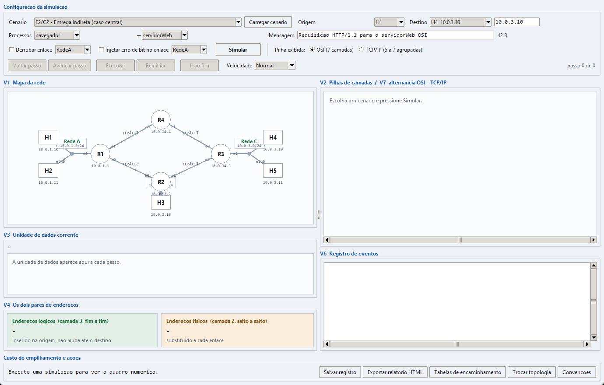
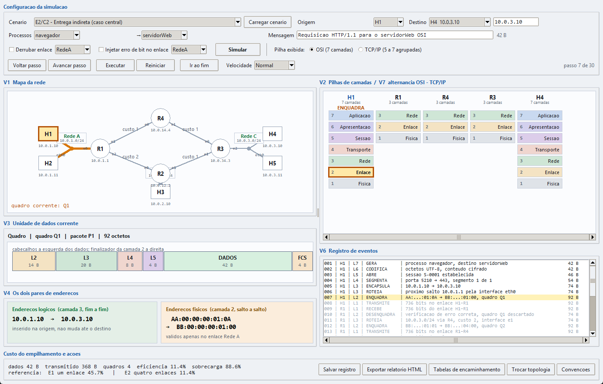
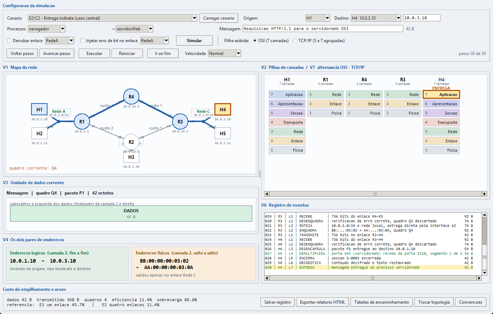

# Tutorial de execução

**Simulador do Modelo OSI**
Comunicação de Dados — Prof. Vinícius S. Borges
Guilherme Matheus Teixeira Costa — 081240041

Este tutorial mostra como colocar o programa para funcionar. Siga os passos na
ordem; ao final você terá confirmado que o simulador funciona nesta máquina.

---

## 1. Pré-requisitos

| Item | Exigência |
|---|---|
| Sistema operacional | Windows 10 ou 11 |
| Python | **Não é necessário** |
| Bibliotecas | **Nenhuma** |
| Espaço em disco | Cerca de 15 MB |
| Preparação de ambiente | Nenhuma |

O executável entregue já contém o interpretador Python e a biblioteca gráfica.
Não instale nada.

---

## 2. Abertura

1. Descompacte o arquivo entregue em uma pasta qualquer.
2. Abra a pasta descompactada. Ela contém, entre outros arquivos:

   ```
   SimuladorOSI.exe     <- é neste que você dá dois cliques
   topologia.json
   README.md
   docs\
   simulador\
   ```

3. **Dê dois cliques em `SimuladorOSI.exe`.**

Mantenha `topologia.json` na mesma pasta do executável: é dele que o programa
lê a rede simulada.

> Na primeira execução o Windows pode levar alguns segundos para abrir a
> janela, porque o executável se descompacta em uma pasta temporária.

---

## 3. Primeira tela



A janela abre com o cenário **E2 – Entrega indireta (caso central)** já
carregado. A tela tem seis áreas:

| Área | Onde fica | O que mostra |
|---|---|---|
| **Configuração da simulação** | topo | Cenário, origem, destino, processos, mensagem, falhas e controles de execução |
| **V1 Mapa da rede** | esquerda, acima | Os nove dispositivos, os enlaces com seus custos e os nomes das interfaces |
| **V3 Unidade de dados corrente** | esquerda, meio | A unidade do passo atual, desenhada em blocos |
| **V4 Os dois pares de endereços** | esquerda, abaixo | Endereços lógicos à esquerda, físicos à direita |
| **V2 Pilhas de camadas** | direita, acima | A pilha de cada dispositivo do percurso |
| **V6 Registro de eventos** | direita, abaixo | Uma linha por ação de uma camada |

No rodapé ficam o quadro numérico da comunicação e os cinco botões de ação.

Os campos do topo, da esquerda para a direita:

- **Cenário** — lista com os sete casos de validação, de E1 a E7;
- **Carregar cenário** — repõe nos campos os valores do cenário escolhido;
- **Origem** — computador que envia;
- **Destino** — computador que recebe; ao lado fica o endereço lógico;
- **Processos** — processo de origem e processo de destino;
- **Mensagem** — texto a enviar; o tamanho em octetos aparece à direita;
- **Derrubar enlace** e **Injetar erro de bit no enlace** — as falhas;
- **Simular** — executa a simulação e prepara a reprodução;
- **Pilha exibida** — alterna entre a pilha OSI e o agrupamento TCP/IP;
- **Voltar passo**, **Avancar passo**, **Executar**, **Reiniciar**, **Ir ao fim** e
  **Velocidade** — o controle da reprodução.

---

## 4. Execução mínima

Esta é a sequência mais curta que produz um resultado na tela.

1. Pressione **Simular**.
   O registro de eventos se preenche com 30 linhas e o rodapé passa a exibir
   `dados 42 B   transmitido 368 B   quadros 4   eficiencia 11.4%`.

2. Pressione **Avancar passo** sete vezes.

---

## 5. Resultado esperado



Depois dos sete passos, a tela deve mostrar:

- no contador do topo, à direita: **passo 7 de 30**;
- no **mapa**, H1 destacado em amarelo e o enlace H1–R1 em laranja;
- nas **pilhas**, a camada 2 de H1 destacada, com `ENQUADRA` acima da coluna;
- na **unidade de dados**, seis blocos:
  `L2 (14 B) | L3 (20 B) | L4 (8 B) | L5 (4 B) | DADOS (42 B) | FCS (4 B)`,
  somando **92 octetos**;
- nos **endereços**: lógicos `10.0.1.10 → 10.0.3.10`, físicos
  `AA:00:00:00:01:0A → BB:00:00:00:01:00`;
- no **registro**, a linha 007 realçada em amarelo.

Se você vê esses valores, o programa está funcionando corretamente.

Para ver o percurso inteiro, pressione **Executar**. A mensagem atravessa
R1, R4 e R3 até H4, e o botão volta a ser **Executar** ao terminar.



---

## 6. Executar a partir do código-fonte

Este passo é opcional e só se aplica a quem tem Python 3.10 ou superior
instalado.

```
python main.py            abre a mesma interface gráfica
python main.py --texto    executa os sete cenários no terminal
```

O arquivo `executar_codigo_fonte.bat` faz o mesmo com dois cliques e avisa,
sem fechar a janela, caso o Python não esteja instalado.

Para rodar os testes automatizados:

```
python -m unittest discover -s tests -v
```

O resultado esperado é `Ran 41 tests` seguido de `OK`.

---

## 7. Problemas conhecidos

| Sintoma | O que fazer |
|---|---|
| A janela demora a abrir na primeira vez | É normal: o executável se descompacta antes de iniciar. Aguarde alguns segundos. |
| Aparece a mensagem *"Arquivo de topologia nao encontrado"* | O arquivo `topologia.json` foi movido. Coloque-o de volta na mesma pasta do `SimuladorOSI.exe`. |
| Aparece *"O arquivo de topologia nao e um JSON valido"* | O arquivo foi editado e ficou malformado. A mensagem indica a linha e a coluna do problema. |
| O antivírus bloqueia o executável | É um falso positivo comum com programas empacotados pelo PyInstaller. Libere o arquivo ou execute o código-fonte com `python main.py`. |
| A janela fecha sozinha | Não deve acontecer: qualquer falha inesperada é mostrada em uma caixa de mensagem antes de o programa encerrar. Se ocorrer, execute `python main.py` para ver a causa no terminal. |
| A janela abre pequena demais | Redimensione ou maximize. O tamanho mínimo é 1120 × 720 pixels. |

---

## 8. Próximo passo

Com o programa aberto e a execução mínima confirmada, siga para o
[tutorial de uso](tutorial_uso.md), que percorre cada função do simulador.
