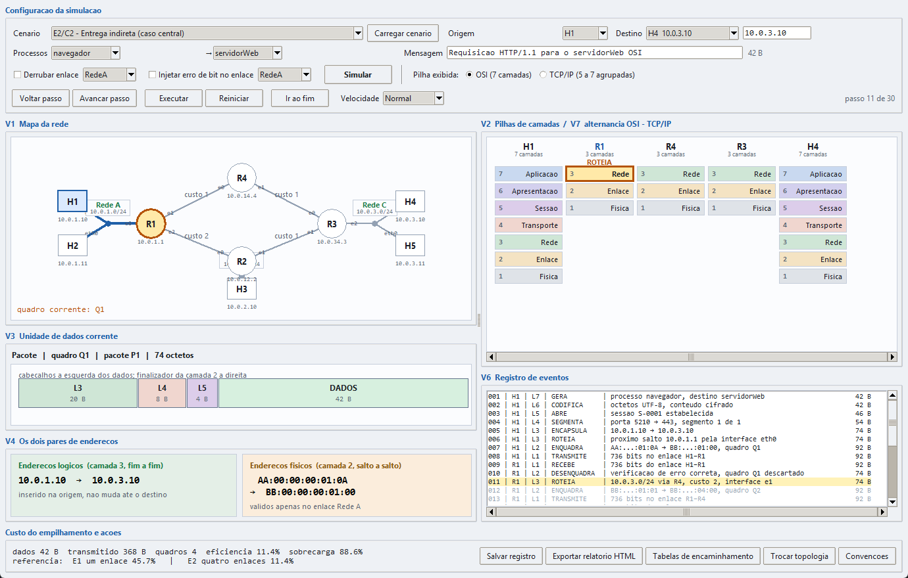
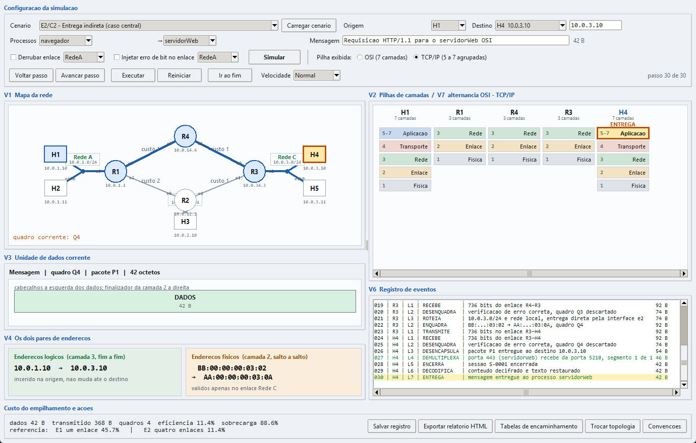
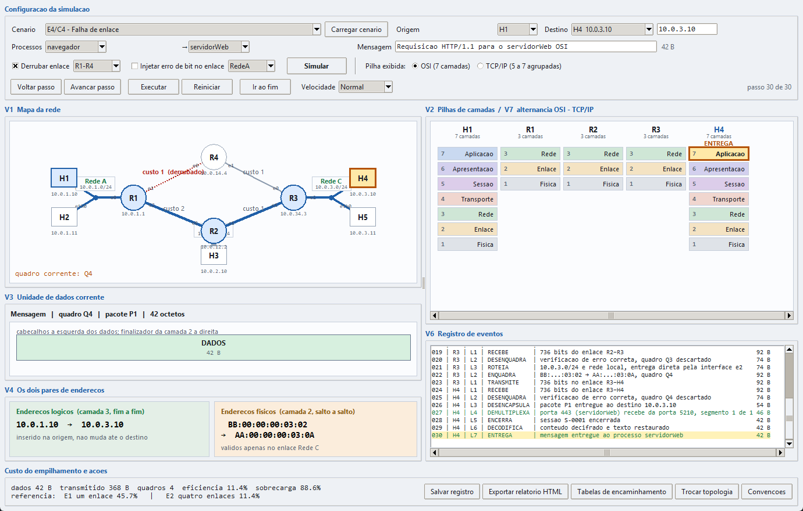
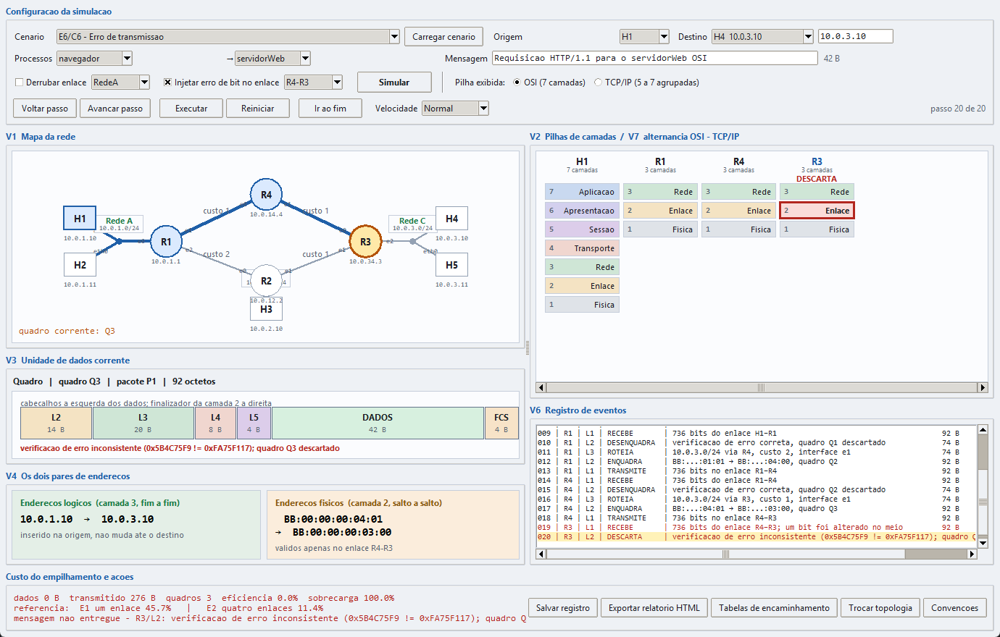
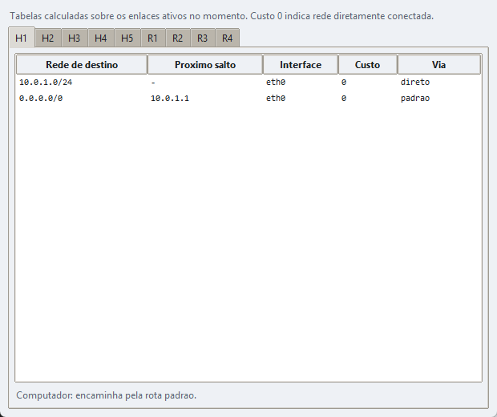
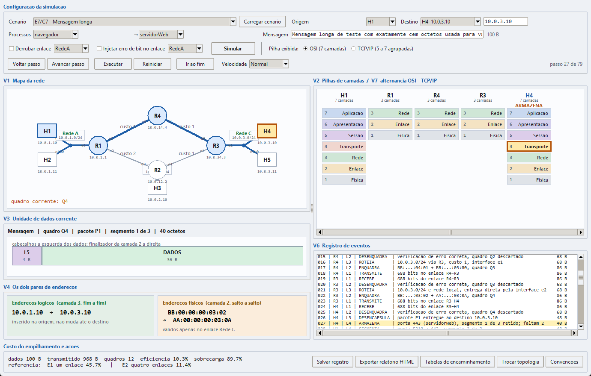

# Tutorial de uso

**Simulador do Modelo OSI**
Comunicação de Dados — Prof. Vinícius S. Borges
Guilherme Matheus Teixeira Costa — 081240041

Este tutorial percorre cada função do programa. Ele supõe que a janela já está
aberta; se não estiver, siga antes o
[tutorial de execução](tutorial_execucao.md).

---

## 1. Escolher o cenário

A lista **Cenário**, no canto superior esquerdo, contém os sete casos de
validação do enunciado.

1. Abra a lista **Cenário**.
2. Escolha um dos sete casos.
3. Pressione **Carregar cenário**.

Os campos abaixo — origem, destino, processos, mensagem e falhas — são
preenchidos com os valores daquele caso, e a tela é limpa para uma nova
execução.

| Cenário | O que exercita |
|---|---|
| E1 – Entrega direta | H1 envia a H2 na mesma rede, sem roteador |
| E2 – Entrega indireta | H1 envia a H4 por R1, R4 e R3; é o caso central |
| E3 – Demultiplexação | H1 e H2 enviam ao mesmo servidor de H4 |
| E4 – Falha de enlace | O enlace R1–R4 cai e a rota passa por R2 |
| E5 – Destino inalcançável | H1 envia a um endereço fora da topologia |
| E6 – Erro de transmissão | Um bit é alterado no enlace R4–R3 |
| E7 – Mensagem longa | A mensagem é dividida em três segmentos |

Escolher o cenário apenas preenche os campos. Nada acontece até você pressionar
**Simular**.

---

## 2. Definir origem, destino e mensagem

Os quatro campos podem ser alterados livremente depois de carregar um cenário.

1. **Origem** — abra a lista e escolha o computador que envia: H1, H2, H3, H4
   ou H5.
2. **Destino** — abra a lista e escolha o computador que recebe. O endereço
   lógico correspondente aparece no campo à direita.
   Para enviar a um endereço que não pertence a nenhum computador, escolha
   **`outro endereco...`** e digite o endereço no campo ao lado.
3. **Processos** — as duas listas definem o processo de origem e o de destino.
   O nome do processo é o endereço específico da camada 7, e cada nome tem uma
   porta associada: `navegador` 5210, `servidorWeb` 443, `clienteEmail` 5220 e
   `servidorEmail` 25.
4. **Mensagem** — digite o texto a enviar. O tamanho em octetos aparece à
   direita do campo e se atualiza a cada tecla.

> **Endereço inválido.** Digite `10.0.300.1` no campo de endereço e pressione
> **Simular**: o programa recusa com uma explicação e continua aberto. O mesmo
> vale para um campo de mensagem vazio.

Depois de ajustar os campos, pressione **Simular**.

---

## 3. Executar a simulação

O controle da reprodução fica na última linha da área de configuração.

| Botão | O que faz |
|---|---|
| **Simular** | Executa a simulação inteira e prepara a reprodução no passo 0 |
| **Avancar passo** | Avança um passo |
| **Voltar passo** | Volta um passo |
| **Executar** | Reproduz continuamente; o botão vira **Pausar** |
| **Pausar** | Interrompe a reprodução no passo corrente |
| **Reiniciar** | Volta ao passo 0 sem refazer a simulação |
| **Ir ao fim** | Salta para o último passo |
| **Velocidade** | Muito lenta, Lenta, Normal ou Rápida |

O contador à direita mostra **passo N de M**. Os botões só ficam ativos depois
que **Simular** é pressionado ao menos uma vez.

**Exemplo.** Na lista **Cenário**, escolha **E2 – Entrega indireta (caso
central)** e pressione **Carregar cenário**. Pressione **Simular** e depois
**Avancar passo** seis vezes: a mensagem desce as camadas 7 a 3 de H1 e a camada 3
acaba de decidir a rota. No sétimo passo o quadro Q1 aparece sobre o enlace
H1–R1.

---

## 4. Ler a tela

### 4.1 O mapa da rede



- **Retângulos** são computadores; **círculos** são roteadores.
- O número sobre cada enlace ponto a ponto é o seu **custo**.
- Os rótulos junto aos dispositivos, como `e0` e `eth0`, são as **interfaces**.
- As caixas verdes identificam cada **rede local** e o seu prefixo.
- O dispositivo que está processando a unidade aparece em **amarelo com borda
  laranja**.
- Os dispositivos já percorridos ficam em **azul**, e o caminho percorrido é
  traçado em azul mais grosso.
- O enlace em uso no passo corrente fica **laranja**.
- Um enlace derrubado aparece **vermelho e tracejado**, com a palavra
  *derrubado* ao lado do custo.
- No canto inferior esquerdo aparece o **quadro corrente**, como `Q1`.

### 4.2 As pilhas de camadas

Uma coluna por dispositivo do percurso. Computadores mostram sete camadas e
roteadores mostram três — é a diferença que a aula estabelece.

A camada que está processando a unidade naquele instante aparece **realçada em
amarelo com borda laranja**, e o nome da ação (`ROTEIA`, `ENQUADRA`,
`DESCARTA`) aparece logo acima da coluna. Quando a ação é um descarte, o
realce é **vermelho**.

Nos roteadores, o destaque da camada 3 no momento da decisão de rota é o ponto
a observar: a unidade sobe até ali e desce de novo, sem nunca alcançar a
camada 4.

### 4.3 A unidade de dados

A faixa mostra a unidade do passo corrente como uma sequência de blocos, com
os cabeçalhos à esquerda dos dados e o finalizador da camada 2 à direita. Cada
bloco traz o rótulo e o seu tamanho em octetos. O título acima informa o nome
da unidade — Mensagem, Segmento, Pacote, Quadro ou Bits —, o número do quadro,
o número do pacote e o tamanho total.

Acompanhe a faixa enquanto pressiona **Avancar passo** no cenário E2:

| Passo | Unidade | Blocos | Total |
|---|---|---|---|
| 1 | Mensagem | `DADOS` | 42 B |
| 3 | Mensagem | `L5 \| DADOS` | 46 B |
| 4 | Segmento | `L4 \| L5 \| DADOS` | 54 B |
| 5 | Pacote | `L3 \| L4 \| L5 \| DADOS` | 74 B |
| 7 | Quadro | `L2 \| L3 \| L4 \| L5 \| DADOS \| FCS` | 92 B |

### 4.4 Os dois pares de endereços

A caixa verde, à esquerda, mostra o par de **endereços lógicos**. A caixa
laranja, à direita, mostra o par de **endereços físicos** e informa em qual
enlace eles valem.

Avance passo a passo pelo cenário E2 e observe: a caixa verde exibe
`10.0.1.10 → 10.0.3.10` do começo ao fim, sem nunca mudar, enquanto a caixa
laranja muda em cada um dos quatro enlaces.

| Enlace | Físico origem | Físico destino |
|---|---|---|
| H1 → R1 | AA:00:00:00:01:0A | BB:00:00:00:01:00 |
| R1 → R4 | BB:00:00:00:01:01 | BB:00:00:00:04:00 |
| R4 → R3 | BB:00:00:00:04:01 | BB:00:00:00:03:00 |
| R3 → H4 | BB:00:00:00:03:02 | AA:00:00:00:03:0A |

### 4.5 O registro de eventos

Cada linha corresponde a uma ação de uma camada de um dispositivo, no formato
`passo | dispositivo | camada | ação | descrição` seguido do tamanho corrente
da unidade. A linha do passo corrente fica realçada em amarelo, as linhas já
percorridas ficam em preto, as futuras em cinza, os descartes em vermelho e as
entregas bem-sucedidas em verde. A área rola na vertical e na horizontal.

---

## 5. Alternar entre as pilhas

No topo, à direita de **Pilha exibida**, há dois botões de opção:

- **OSI (7 camadas)** — a pilha completa;
- **TCP/IP (5 a 7 agrupadas)** — as camadas 5, 6 e 7 viram uma única camada de
  aplicação.



Pressione um e depois o outro a qualquer momento, inclusive no meio de uma
reprodução. A simulação não se altera: muda apenas o agrupamento exibido, e o
passo corrente continua o mesmo. Nos roteadores nada muda, porque eles não
possuem as camadas 5 a 7.

---

## 6. Provocar falhas

### 6.1 Derrubar um enlace

1. Marque a caixa **Derrubar enlace**.
2. Na lista ao lado, escolha **`R1-R4`**.
3. Pressione **Simular** e depois **Ir ao fim**.



O enlace R1–R4 aparece vermelho e tracejado no mapa, e o caminho destacado
passa a ser **H1 – R1 – R2 – R3 – H4**. No registro, a linha de roteamento de
R1 passa a informar `10.0.3.0/24 via R2, custo 3, interface e2`.

O enlace é restaurado automaticamente ao final da execução; a caixa marcada é
que faz o efeito valer na próxima simulação.

### 6.2 Injetar um erro de bit

1. Marque a caixa **Injetar erro de bit no enlace**.
2. Na lista ao lado, escolha **`R4-R3`**.
3. Pressione **Simular** e depois **Ir ao fim**.



O percurso para em R3. No registro:

```
019 | R3 | L1 | RECEBE       | 736 bits do enlace R4–R3; um bit foi alterado no meio
020 | R3 | L2 | DESCARTA     | verificacao de erro inconsistente (...); quadro Q3 descartado
```

Confira o ponto central: **não há nenhuma linha de camada 3 em R3**. O quadro
foi descartado pela camada 2 e nenhuma camada superior chegou a ser acionada.
Na pilha de R3, a camada 2 fica realçada em vermelho e a camada 3 permanece
apagada. O rodapé informa `mensagem nao entregue`.

### 6.3 Enviar a um endereço inalcançável

1. Na lista **Destino**, escolha **`outro endereco...`**.
2. Digite **`10.0.9.10`** no campo ao lado.
3. Pressione **Simular** e depois **Ir ao fim**.

H1 tem rota padrão e entrega o pacote a R1. R1 é o primeiro nó sem rota para
esse endereço e descarta o pacote na camada 3:

```
011 | R1 | L3 | DESCARTA     | sem rota para 10.0.9.10; pacote descartado
```

O caminho destacado no mapa vai apenas de H1 até R1.

---

## 7. Trocar a rede simulada

A rede é lida de `topologia.json`, ao lado do executável. Há duas formas de
trocá-la, e nenhuma delas exige gerar um novo executável.

**Substituindo o arquivo:**

1. Feche o programa.
2. Substitua `topologia.json` pelo arquivo da outra rede, mantendo o nome.
3. Abra o `SimuladorOSI.exe` novamente.

**Sem fechar o programa:**

1. Pressione **Trocar topologia**, no rodapé.
2. Escolha o arquivo `.json` da outra rede.
3. Uma mensagem confirma quantos computadores, roteadores e segmentos foram
   carregados, e os campos são repovoados com a nova rede.

Se o arquivo estiver ausente ou malformado, o programa explica o problema e
continua aberto com a rede anterior.

O formato do arquivo está descrito na seção 11 da
[documentação técnica](documentacao_projeto.md).

---

## 8. Consultar as tabelas de encaminhamento

Pressione **Tabelas de encaminhamento**, no rodapé. Uma janela se abre com uma
aba por dispositivo.



Cada linha traz a rede de destino, o próximo salto, a interface de saída, o
custo e o roteador por onde a rota passa. Custo 0 indica rede diretamente
conectada. As tabelas são calculadas sobre os enlaces ativos no momento, de
modo que derrubar um enlace e reabrir a janela mostra as rotas recalculadas.

Ao lado, o botão **Convenções** abre a lista dos parâmetros que determinam os
números da execução: tamanhos de cabeçalho, limiar de segmentação, carga por
segmento e critério de desempate entre rotas.

---

## 9. Salvar o registro de eventos

1. Pressione **Salvar registro**, no rodapé.
2. Escolha a pasta e o nome do arquivo. O padrão é `registro_eventos.txt`, na
   pasta do programa.
3. Pressione **Salvar**. Uma mensagem confirma o caminho do arquivo.

O arquivo contém todas as linhas do registro, precedidas de um cabeçalho com o
cenário, a rede simulada e o quadro numérico da execução.

O botão **Exportar relatório HTML** grava um relatório completo em um arquivo
único, que pode ser aberto em qualquer navegador. Ele reúne o cenário, o
quadro numérico, a tabela de quadros com os dois pares de endereços, o desenho
da unidade de dados, as tabelas de encaminhamento, o registro inteiro e a
lista de convenções. Ao final o programa pergunta se deve abri-lo.

---

## 10. Conferir um resultado conhecido

Use esta seção para confirmar que o programa produz na sua máquina os mesmos
números de referência.

**Cenário E2 — entrega indireta.**

1. Escolha **E2 – Entrega indireta (caso central)** e pressione
   **Carregar cenário**.
2. Pressione **Simular** e depois **Ir ao fim**.

Confira:

| O que conferir | Valor esperado |
|---|---|
| Caminho destacado no mapa | H1 – R1 – R4 – R3 – H4 |
| Total de passos | 30 |
| Quadros construídos | 4, numerados Q1 a Q4 |
| Pacotes | 1, numerado P1 |
| Tamanho de cada quadro | 92 octetos |
| Octetos de dados | 42 B |
| Octetos transmitidos | 368 B |
| Eficiência | 11,4 % |
| Sobrecarga | 88,6 % |
| Endereços lógicos | 10.0.1.10 → 10.0.3.10 nas quatro linhas |
| Endereços físicos | mudam nos quatro enlaces, conforme a tabela da seção 4.4 |

No rodapé, a linha de referência compara os dois casos pedidos pelo enunciado:
**E1 com um enlace, 45,7 %** e **E2 com quatro enlaces, 11,4 %**.

**Cenário E7 — mensagem longa.**



1. Escolha **E7 – Mensagem longa** e pressione **Carregar cenário**.
2. Pressione **Simular** e depois **Ir ao fim**.

Confira:

| O que conferir | Valor esperado |
|---|---|
| Mensagem | 100 octetos |
| Segmentos | 3, com cargas de 40, 40 e 24 octetos |
| Quadros | 12, numerados Q1 a Q12 |
| Octetos transmitidos | 968 B |
| Eficiência | 10,3 % |
| Camada 4 de H4 | três `ARMAZENA` seguidos de um `REMONTA` |
| Camada 5 de H4 | acionada **depois** do `REMONTA`, nunca antes |

**Quadro resumo dos sete cenários**

| Cenário | Caminho | Quadros | Dados | Transmitido | Eficiência | Entregue |
|---|---|---|---|---|---|---|
| E1 | H1 – H2 | 1 | 42 B | 92 B | 45,7 % | sim |
| E2 | H1 – R1 – R4 – R3 – H4 | 4 | 42 B | 368 B | 11,4 % | sim |
| E3 | dois fluxos até H4 | 8 | 84 B | 736 B | 11,4 % | sim |
| E4 | H1 – R1 – R2 – R3 – H4 | 4 | 42 B | 368 B | 11,4 % | sim |
| E5 | H1 – R1 | 1 | 0 B | 92 B | 0 % | não |
| E6 | H1 – R1 – R4 – R3 | 3 | 0 B | 276 B | 0 % | não |
| E7 | H1 – R1 – R4 – R3 – H4 | 12 | 100 B | 968 B | 10,3 % | sim |
